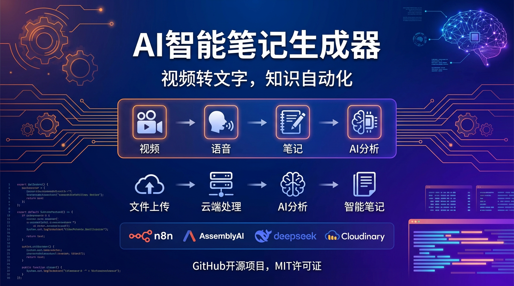

# 🎬 VideoNote AI

## AI视频字幕提取与智能笔记生成工具

<div align="center">
  
</div>

基于n8n工作流的自动化视频字幕提取和AI笔记生成系统，能够将视频内容转换为结构化的学习笔记。

## ✨ 功能特性

- 🎵 **多格式音频支持**：支持从视频文件提取音频
- 🗣️ **智能语音识别**：使用AssemblyAI进行高精度语音转文字
- 🤖 **AI笔记生成**：基于DeepSeek大模型生成结构化学习笔记
- 📁 **云端存储**：集成Cloudinary进行文件管理
- 🔄 **自动化流程**：端到端自动化处理，无需人工干预
- 📋 **结构化输出**：生成包含主题、要点、应用建议等的完整笔记

## 🏗️ 系统架构


## 🚀 快速开始

### 前置要求

- [n8n](https://n8n.io/) 工作流平台
- [AssemblyAI](https://www.assemblyai.com/) API密钥
- [DeepSeek](https://www.deepseek.com/) API密钥
- [Cloudinary](https://cloudinary.com/) 账户

### 安装步骤

1. **克隆仓库**
```bash
git clone https://github.com/Health-525/videonote-ai.git
cd videonote-ai
```

2. **导入工作流**
   - 打开n8n工作流界面
   - 导入 `video-subtitle-workflow.json` 文件

3. **配置API密钥**

   在n8n中配置以下凭据：

   - **AssemblyAI API**：语音转录服务
   - **DeepSeek API**：AI文本分析
   - **Cloudinary API**：文件存储服务

4. **启动工作流**
   - 激活工作流
   - 获取表单提交URL

## 📖 使用指南

### 基本使用

1. 访问工作流提供的表单链接
2. 上传视频/音频文件
3. 系统自动处理并生成笔记
4. 下载生成的学习笔记文件

### 支持的文件格式

- **视频**：MP4, AVI, MOV, MKV
- **音频**：MP3, WAV, M4A, FLAC

### AI笔记结构

生成的笔记包含以下部分：

- 🎯 **视频主题**：核心内容概括
- 🧩 **关键概念与公式**：重要概念提取
- 🧠 **知识逻辑**：内容逻辑关系
- 📚 **学习重点**：3-5个关键要点
- 🧰 **实际应用**：ML/DL应用场景
- 🗒️ **学习建议**：复习和扩展建议

## ⚙️ 配置说明

### 环境变量

```bash
# AssemblyAI配置
ASSEMBLYAI_API_KEY=your_assemblyai_key

# DeepSeek配置
DEEPSEEK_API_KEY=your_deepseek_key

# Cloudinary配置
CLOUDINARY_CLOUD_NAME=your_cloud_name
CLOUDINARY_API_KEY=your_api_key
CLOUDINARY_API_SECRET=your_api_secret
```

### 工作流节点说明

| 节点 | 功能 | 说明 |
|------|------|------|
| Form Trigger | 文件接收 | 提供文件上传表单 |
| Cloudinary | 文件存储 | 上传文件到云存储 |
| HTTP Request (1) | 转录请求 | 发起AssemblyAI转录任务 |
| Wait | 等待处理 | 等待转录完成 |
| HTTP Request (2) | 获取结果 | 获取转录文本 |
| AI Agent | 智能分析 | 使用DeepSeek分析内容 |
| Convert to File | 文件转换 | 生成下载文件 |

## 🔧 自定义配置

### 自定义提示词

可以在AI Agent节点中修改提示词，适应不同类型的内容分析需求（技术教程、语言学习等）。

### 调整输出格式

在Structured Output Parser中可以自定义输出JSON格式，添加更多字段如难度级别、学习时长等。

## 🔍 故障排除

### 常见问题

**Q: 转录失败怎么办？**
- 检查AssemblyAI API密钥是否正确
- 确认音频质量和格式支持
- 查看API配额是否用尽

**Q: AI分析结果不理想？**
- 调整AI Agent的提示词
- 检查DeepSeek API配置
- 尝试不同的输出格式

**Q: 文件上传失败？**
- 检查Cloudinary配置
- 确认文件大小限制
- 验证网络连接

💡 **提示**：在n8n执行历史中可以查看详细的日志信息。

## 🤝 贡献指南

欢迎提交Issue和Pull Request！

1. Fork 本仓库
2. 创建功能分支：`git checkout -b feature/new-feature`
3. 提交更改：`git commit -am 'Add new feature'`
4. 推送分支：`git push origin feature/new-feature`
5. 提交Pull Request

## 📄 许可证

本项目采用 [MIT 许可证](LICENSE)

## 🔗 相关链接

- [n8n 官方文档](https://docs.n8n.io/)
- [AssemblyAI API 文档](https://www.assemblyai.com/docs/)
- [DeepSeek API 文档](https://platform.deepseek.com/api-docs/)
- [Cloudinary 文档](https://cloudinary.com/documentation)

## 🙋‍♂️ 支持

如有问题或建议，请通过以下方式联系：

- 🐛 问题反馈: [GitHub Issues](../../issues)
- 💬 讨论交流: [GitHub Discussions](../../discussions)

---

⭐ 如果这个项目对您有帮助，请给一个Star支持！